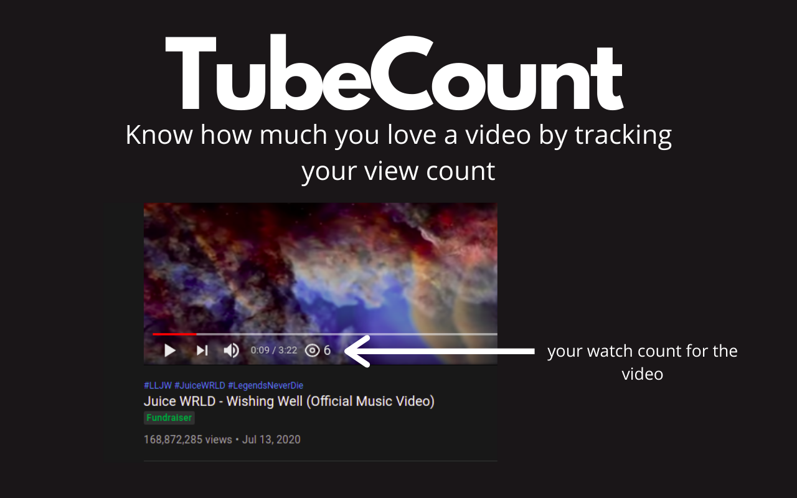

    

    TubeCount

    
     Know how much you love a video by tracking your view count
    

---
 

    
 

## what is this ?
 - it will count how many times you have seen a video!

 ---

## How to run

- Clone the repo
- open chrome and make sure developer mode turned on and hit `load unpacked extension` and select `/chrome` dir.

---

> ## Take a glance

 

    
 

    
 

